# Fast Logger


[](https://pypi.org/project/python-fast-logger/)
[](https://opensource.org/licenses/MIT)
[](https://www.python.org/downloads/)

<p align="center">
  
</p>

**A developer-experience toolkit disguised as a logging library.**

Fast Logger gives you zero-config, dependency-free logging with built-in debugging superpowers: rich tracebacks with heuristic fix suggestions, one-line framework integrations, session recording & export, a full CLI toolkit, and themes — all out of the box.

---

## Why Fast Logger?

| Feature | `logging` | `loguru` | **fast-logger** |
|---|---|---|---|
| Zero config | ❌ | ✅ | ✅ |
| Zero dependencies | ✅ | ❌ | ✅ |
| Rich tracebacks + fix suggestions | ❌ | ❌ | ✅ |
| One-line framework plugins | ❌ | ❌ | ✅ |
| Session record & export (HTML/MD) | ❌ | ❌ | ✅ |
| TUI log viewer & CLI toolkit | ❌ | ❌ | ✅ |
| Built-in themes | ❌ | ❌ | ✅ |
| Secret masking | ❌ | ❌ | ✅ |
| Async-safe (QueueHandler) | Manual | ✅ | ✅ |

---

## Installation

```bash
# Core — zero dependencies
pip install python-fast-logger

# With beautiful Rich terminal output (recommended)
pip install "python-fast-logger[rich]"

# With TUI interactive viewer
pip install "python-fast-logger[tui]"
```

---

## Quick Start

```python
from fast_logger import FastLogger

logger = FastLogger()  # zero-config, name defaults to "app"
logger.info("Server started")
logger.warning("Memory usage high")
logger.error("Connection refused")
```

Or the classic one-liner:

```python
from fast_logger import quick_logger
logger = quick_logger("my_app")
```

---

## Core Features

### JSON Structured Logging

```python
logger = FastLogger("api", json_format=True)
logger.info("Request processed")
# {"timestamp": "2026-07-10T19:00:00", "level": "INFO", "logger": "api", "message": "Request processed"}
```

### Async-Safe Logging

Non-blocking logging with `QueueHandler`/`QueueListener` — safe for multithreaded and async applications:

```python
logger = FastLogger("worker", async_safe=True)
```

### Rotating File Logs with Compression

```python
logger = FastLogger(
    "app",
    max_file_size_mb=100,
    backup_count=5,
    compress_backups=True,  # gzip old log files
)
```

### Secret Masking

Automatically redact passwords, API keys, and tokens from your logs:

```python
logger = FastLogger("secure", mask_secrets=True)
logger.info("Connecting with password='super_secret_password'")
# Output: Connecting with password='********'
```

---

## Theme Support

```python
logger = FastLogger("app", theme="cyberpunk")   # neon blue/pink/yellow
logger = FastLogger("app", theme="dracula")     # classic Dracula palette
logger = FastLogger("app", theme="minimal")     # monochrome, no icons
logger = FastLogger("app", theme="default")     # clean, professional
```

Available themes: `default`, `cyberpunk`, `dracula`, `minimal`

---

## Developer Productivity Tools

### Context Binding

Inject persistent context (request IDs, user IDs) into every subsequent log:

```python
ctx_logger = logger.bind(request_id="req-123", user_id=42)
ctx_logger.info("Processing payment")
# {"message": "Processing payment", "request_id": "req-123", "user_id": 42, ...}
```

### Execution Timer

```python
with logger.timer("Database query"):
    results = db.execute("SELECT * FROM users")
# [INFO] Database query took 142.30ms
```

### Function Tracing

```python
@logger.trace(level="DEBUG")
def fetch_data(url: str):
    return requests.get(url)
# [DEBUG] ENTER fetch_data()
# [DEBUG] EXIT fetch_data() took 312.45ms
```

### Function Profiling

```python
@logger.profile()
def compute():
    return sum(range(10_000_000))
# [INFO] compute() completed in 0.1234s | Memory: +1.2 MiB
```

### Variable Watcher & Diff

```python
logger.watch("config", {"debug": True, "db_host": "localhost"})
logger.diff(old_config, new_config)
```

---

## Rich Rendering (optional `rich` dependency)

All of these degrade gracefully to plain text if `rich` is not installed:

```python
# Beautiful tables
logger.table([{"name": "Alice", "role": "Admin"}, {"name": "Bob", "role": "User"}])

# Tree structures
logger.tree("Config", {"database": {"host": "localhost", "port": 5432}, "cache": {"ttl": 300}})

# JSON pretty-printing
logger.json({"status": "ok", "latency_ms": 42})

# SQL syntax highlighting
logger.sql("SELECT * FROM users WHERE id = 42")

# HTTP request/response inspection
logger.http(response)

# Object inspection
logger.inspect(my_object)

# Styled panels
logger.panel("Anomaly detected in checkout flow", title="AI Agent")

# Markdown rendering
logger.markdown("# Deployment Report\n- ✅ All tests passed\n- ⚠️ 2 deprecation warnings")

# Progress bars
with logger.progress() as progress:
    task = progress.add_task("Processing", total=100)
    for i in range(100):
        progress.advance(task)

# cURL command generation
logger.curl({"method": "POST", "url": "https://api.example.com/v1/users", "headers": {"Authorization": "Bearer ..."}})
```

---

## Smart Exception Handling

`logger.catch()` gives you Rust-style diagnostics — not just a traceback, but **why** it happened and **how** to fix it:

```python
with logger.catch("Processing user data"):
    users = fetch_users()
    admin = users[999]  # IndexError
```

Output:
```
╭─ Exception ──────────────────────────────────────────╮
│ IndexError                                           │
│ list index out of range                              │
╰──────────────────────────────────────────────────────╯
╭─ Traceback ──────────────────────────────────────────╮
│ app.py:42   process()                                │
│               admin = users[999]                     │
╰──────────────────────────────────────────────────────╯
╭─ Diagnostics ────────────────────────────────────────╮
│ Likely Causes          │ Suggested Fixes             │
│ • Loop exceeded list   │ ✓ Add bounds check          │
│   length               │ ✓ Use enumerate()           │
│ • Off-by-one error     │ ✓ Don't mutate while        │
│                        │   iterating                 │
╰──────────────────────────────────────────────────────╯
```

Supports 15+ exception types: `ConnectionRefusedError`, `KeyError`, `ImportError`, `AttributeError`, `FileNotFoundError`, `TimeoutError`, `RecursionError`, `ZeroDivisionError`, `TypeError`, `ValueError`, `PermissionError`, `MemoryError`, and more.

**IDE Hyperlinks**: File paths in tracebacks are clickable OSC 8 terminal links (VS Code, PyCharm, iTerm2).

---

## Framework Plugins

One-line integrations. All plugins are **optional** — they only activate if the target library is installed:

### FastAPI

```python
# Option A: Auto-patch all new FastAPI instances
logger.use("fastapi")

# Option B: Patch an existing app
logger.patch_fastapi(app)
```

Automatically logs: request method, path, status code, latency, correlation ID (`X-Request-ID`), and exceptions.

### Flask

```python
logger.patch_flask(app)
# or
logger.use("flask", app)
```

Logs: incoming requests, response status, latency, and request IDs via `before_request` / `after_request` hooks.

### Redis

```python
logger.patch_redis(redis_client)
# or
logger.use("redis", redis_client)
```

Logs every Redis command with latency:
```
Redis GET user:42 → 3.2ms
```

### OpenAI

```python
logger.patch_openai()
# or
logger.use("openai")
```

Automatically logs: model name, input/output tokens, estimated cost (USD), and latency:
```
OpenAI gpt-4o | in=1200 out=350 tokens | $0.006500 | 1823ms
```

### Celery

```python
logger.patch_celery(celery_app)
# or
logger.use("celery", celery_app)
```

Logs task lifecycle via Celery signals: started, finished (with duration), failed (with exception), retrying.

### Requests (HTTP)

```python
logger.patch_requests()
# or
logger.use("requests")
```

Automatically logs all outgoing `requests` calls with method, URL, status code, and latency.

### SQLAlchemy

```python
logger.use("sqlalchemy")
```

Logs SQL queries and execution times.

---

## Session Recording & Export

Record your debugging sessions and export them for bug reports:

```python
# Start recording
logger.record()

# ... do your debugging ...
logger.info("Investigating issue #42")
logger.error("Found the bug!")

# Save session
logger.save("bug.fl")

# Export to HTML (beautiful dark-themed, searchable report)
logger.export_html("bug.fl")

# Export to Markdown (paste into GitHub Issues)
logger.export_markdown("bug.fl")
```

### Session Replay

```bash
fastlogger replay bug.fl
```

### TUI Viewer

```bash
fastlogger ui bug.fl
```

---

## CLI Toolkit

The `fastlogger` CLI ships with every installation:

```bash
# Environment health check
fastlogger doctor

# Scaffold a config file
fastlogger init

# Log file stats (level counts, top messages)
fastlogger stats app.log

# Real-time colorized tailing
fastlogger tail logs/app.log

# Session replay with original timing
fastlogger replay bug.fl

# Interactive TUI log viewer (requires textual)
fastlogger ui bug.fl

# Gantt chart timeline from session files
fastlogger timeline bug.fl

# Benchmark fast-logger vs logging vs loguru
fastlogger benchmark
```

---

## Timeline & Profiling

```python
# Synchronous timeline
with logger.timeline("Database migration"):
    run_migrations()
# [INFO] Timeline [Database migration] END (2.341s)

# Async timeline
async with logger.async_timeline("LLM call"):
    response = await openai_client.chat.completions.create(...)
# [INFO] Async Timeline [LLM call] END (1.823s)

# OpenTelemetry spans (if opentelemetry is installed)
with logger.span("checkout-flow"):
    process_checkout()
```

---

## System Telemetry

```python
logger.sysinfo()
```

Dumps OS, Python version, hostname, CPU count, memory usage, and container detection (Docker/K8s).

---

## Advanced Configuration

```python
from fast_logger import FastLogger

logger = FastLogger(
    name="my_app",
    level="DEBUG",
    log_folder="custom_logs",
    max_file_size_mb=100,
    backup_count=5,
    console_output=True,
    json_format=True,
    async_safe=True,
    mask_secrets=True,
    compress_backups=True,
    color_output=True,
    theme="dracula",
    pretty_exceptions=True,
)
```

### Load from Config File

```python
logger = FastLogger.from_config("fast_logger.json")
```

Generate a starter config with `fastlogger init`.

### Configuration Options

| Parameter | Type | Default | Description |
|---|---|---|---|
| `name` | `str` | `"app"` | Logger name (also used as log filename) |
| `level` | `str/int` | `INFO` | Logging level |
| `log_folder` | `str` | `"logs"` | Directory for log files |
| `max_file_size_mb` | `int` | `50` | Max size per log file |
| `backup_count` | `int` | `3` | Number of rotated backups |
| `console_output` | `bool` | `True` | Log to terminal |
| `json_format` | `bool` | `False` | Structured JSON output |
| `color_output` | `bool` | `True` | ANSI colors in terminal |
| `async_safe` | `bool` | `False` | Thread-safe QueueHandler |
| `mask_secrets` | `bool` | `False` | Auto-redact sensitive data |
| `compress_backups` | `bool` | `False` | Gzip rotated log files |
| `theme` | `str` | `"default"` | Color theme name |
| `pretty_exceptions` | `bool` | `True` | Rich traceback formatting |
| `base_path` | `str` | Caller's dir | Base directory for logs |
| `log_format` | `str` | Default | Custom format string |

---

## API Reference

### Logging Methods
`debug()`, `info()`, `success()`, `warning()`, `error()`, `critical()`, `exception()`

### Productivity
`bind()`, `timer()`, `trace()`, `profile()`, `catch()`, `watch()`, `diff()`

### Rich Rendering
`table()`, `tree()`, `json()`, `sql()`, `http()`, `inspect()`, `panel()`, `markdown()`, `progress()`, `curl()`, `benchmark()`

### Framework Plugins
`use()`, `patch_fastapi()`, `patch_flask()`, `patch_redis()`, `patch_openai()`, `patch_celery()`, `patch_requests()`

### Session & Export
`record()`, `save()`, `export_html()`, `export_markdown()`

### Timing & Telemetry
`timer()`, `timeline()`, `async_timeline()`, `span()`, `sysinfo()`, `screenshot()`

---

## Requirements

- **Python 3.9+**
- **Zero required dependencies** — everything works with the standard library

### Optional Dependencies

| Package | Enables |
|---|---|
| `rich` | Beautiful terminal rendering, syntax highlighting, panels |
| `textual` | Interactive TUI log viewer (`fastlogger ui`) |
| `Pillow` | Screenshot capture (`logger.screenshot()`) |
| `psutil` | Enhanced system telemetry in `sysinfo()` |
| `opentelemetry-api` | Distributed tracing with `logger.span()` |

---

## ❤️ Support fast-logger

If fast-logger has saved you time or helped your project, please consider supporting its development.

- ⭐ **Star this repository** — it helps others discover fast-logger
- ☕ [**Buy me a coffee**](https://buymeacoffee.com/ravimishra94)
- ❤️ **Sponsor on GitHub**

<a href="https://github.com/sponsors/RaviMishra-94">
  
</a>
<a href="https://buymeacoffee.com/ravimishra94">
  
</a>

<br><br>

<a href="https://github.com/sponsors/RaviMishra-94">
  
</a>

---

## License

MIT License. See [LICENSE](LICENSE) for details.